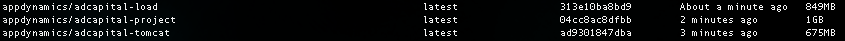

## Downloading and Building Source code

To get started with our code, first clone the repo, and then cd into the repo, and build the server code
```
git clone https://github.com/Appdynamics/AD-Capital-Docker.git
cd AD-Capital-Docker
cd ADCapital-Tomcat
docker-compose build
```

Then once you have built the server code, go into the main project and build those Images (in project AD-Capital-Docker)
```
docker-compose build
```

Confirm your images are built below by typing `docker images`.
You should see three images that look like this


