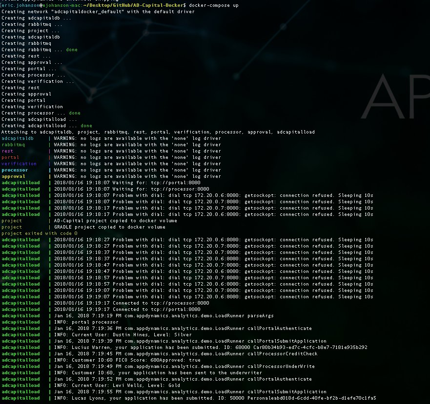

## Running the AD-Capital Demo without AppD

There is a docker-compose file provided to start the demo containers, including load generation.  

The project uses a docker volume to store the agent binaries and log/config files.  You will need to create this externally (`docker volume create --name=appdynamics`) before running the project: there is no need to install agents until you wish to run with monitoring enabled.  The project will create a separate volume (*adcapitaldocker_project*) where the source code project is mounted and built.  This volume will be removed when you stop the project (use the *-v* option). You will also need to create a second volume externally if you intend to use the machine agent to gather logs for analytics. (`docker volume create --name=project`).

Run the following commands to start and stop the demo:

1. `docker-compose up`
2. `docker-compose down -v`

When you run the application, you should see something like this below, with transactions appearing in the log. If you're getting an error, go into the main projects docker-compose.yml and comment out the logging:none components to get terminal facing logs

