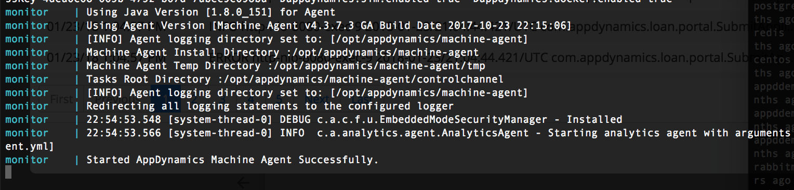
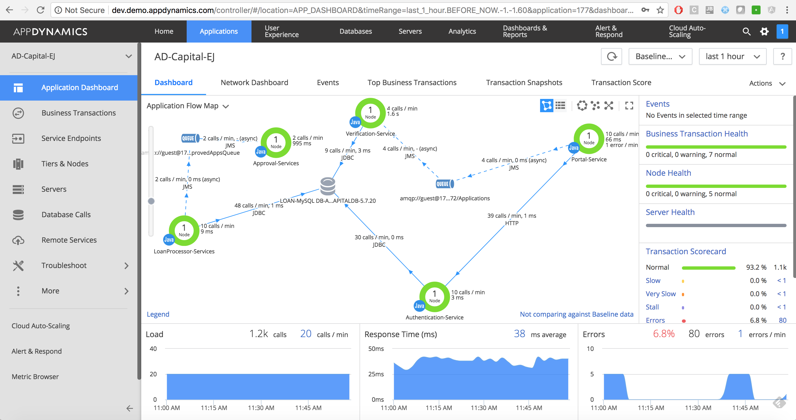

## Running the AD-Capital Demo with AppD monitoring and docker Visibility

To add monitoring using AppDynamics APM Agents, download the desired version of the Java Agent (Sun and JRockit JVM) and a standlaone machine agent (NO JRE). 

If you do not have an AppDynamics account you can sign up for a [free trial](https://www.appdynamics.com/free-trial/). Once you've done that you can download the latest agent/controller versions directly from the [AppDynamics download site](https://download.appdynamics.com). You will need a Java Agent (Sun and JRockit JVM), a Standalone Machine Agent (NO JRE), and a standard controller. Give the filename and SHA256 checksum information in *ADCapital-AppDynamics/docker-compose.yml*, then cd to the *ADCapital-AppDynamics* directory and give the agent filename and SHA256 checksum. Add the four digit version string (e.g *4.3.3.6*) in the main project's *docker-compose.env* file.

First you will need to go into the appropriate directories and build the Images

1. AppDynamics Agents: `cd ADCapital-AppDynamics; docker-compose up --build`  This will validate the agent installation, copy the files to the shared volume and configure monitoring for the application containers. 

2. AppDynamics Docker Visibility: `cd ADCapital-Monitor; docker-compose build`


Proceed to fillout the remaining environment variables in the docker-compose.env file with the appropriate controller variables. Note the tier and node names are passed in
as environment variables from the main projects docker-compose file. Use the event
service variables as defined below

```
APPDYNAMICS_AGENT_APPLICATION_NAME=
APPDYNAMICS_AGENT_ACCOUNT_NAME=
APPDYNAMICS_AGENT_ACCOUNT_ACCESS_KEY=
APPD_ES_HOST=analytics.api.appdynamics.com
APPD_ES_PORT=443
APPD_ES_SSL=True
APPD_EVENT_ACCOUNT_NAME=
APPDYNAMICS_CONTROLLER_HOST_NAME=
APPDYNAMICS_CONTROLLER_PORT=
APPDYNAMICS_CONTROLLER_SSL_ENABLED=False
APPD_DIR=/appdynamics
APPD_AGENT_VERSION=
RETRY=10s
TIMEOUT=90s
```

Once the appropriate environment variables are filled in for the three separate files, ADCapital-Monitor/docker-compose.yml, ADCapital-AppDynamics/docker-compose.yml, and docker.env, restart the application in the normal way to run the apm agents. In another terminal window. Go
into the ADCapital-Monitor folder and run `docker-compose up` to start the machine agent.

You should see something like this in the terminal to know the machine agent is working.



Once you've started the application with monitoring enabled, navigate to the controller,
select the app you've named, and you should see this



For those extra curious, have a look at the individual start up scripts for /AppDynamics
and /monitor to show how it's spun up
